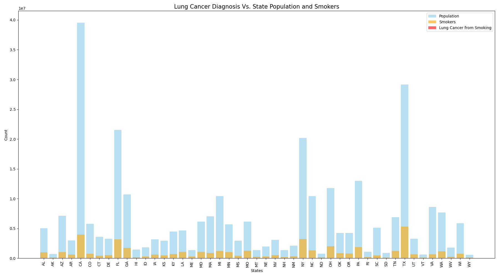

# Exploring Early Detection Methods for Non-Small Cell Lung Cancer Using Machine Learning Models

**Authors:** Nefertiti Muhammad, Adrian De La Cruz, Joe Coffaro, Alexander Walden

## Overview

Together, small cell lung cancer (SCLC) and non-small cell lung cancer (NSCLC) are the second most common cancers in the United States. Approximately 10% to 15% of all lung cancers are SCLC, while NSCLC accounts for about 80% to 85%. Lung cancer is the leading cause of cancer-related deaths in the U.S., often diagnosed at later stages, which complicates treatment and negatively impacts survival rates. Research into early detection methods is crucial for improving patient outcomes.

In this project, we developed neural network and regression models to predict survival outcomes for NSCLC patients. Our goal is to utilize machine learning to identify factors that can aid in early detection.

*Figure 1: Lung cancer incidence in the U.S.*

## Dataset

The dataset utilized for this project is sourced from the paper "Distinct patterns of somatic genome alterations in lung adenocarcinomas and squamous cell carcinomas" (Nat Genet. 2016 Jun;48(6):607-16. doi: 10.1038/ng.3564). It was downloaded from cBioPortal:

[NSCLC TCGA Broad 2016 Dataset](https://www.cbioportal.org/study/clinicalData?id=nsclc_tcga_broad_2016)

This dataset includes demographic, lifestyle, and genomic data, allowing us to analyze differences among patients and build predictive models.

The NCI Cancer Atlas was also used to gather data on lung cancer incidence in th U.S. by State (2017 - 2021)
https://gis.cancer.gov/canceratlas/tableview/?d=1&a=1&r=1&s=33

## Methodology

1. **Data Preprocessing**
   - Cleaning and preparing the dataset for analysis.
   - Handling missing values and normalizing data.

2. **Model Development**
   - Implementing neural network models for predictive analysis.
   - Utilizing regression techniques to evaluate survival outcomes.

3. **Evaluation Metrics**
   - Assessing model performance using metrics such as accuracy, precision, recall, and F1-score.

## Results

### Neural Network Model

- **Accuracy**: 
- **Final Training Loss**: 
- **Validation Loss**: 
- **AUC**: 
- **Confusion Matrix**: 
  - True Positives (TP): 
  - True Negatives (TN): 
  - False Positives (FP): 
  - False Negatives (FN): 
  - **Precision**: 
  - **Recall**: 
- **Training Epochs**: 

### Regression Model

- **R-squared Value**: 
- **Significant Predictor Coefficients**:
- **P-value for Smoking Status**: 
- **Mean Absolute Error**: 
- **Residuals**: Mean = , Standard Deviation = 

## Limitations

*Figure 2: Early diagnosis may predict longer survival.*

*Figure 1: Lung cancer incidence in the U.S.*

*Figure 2: Early diagnosis may predict longer survival.*

*Figure 3: History of malignancy decreases survival.*

*Figure 4: Non-smoking not necessarily correlated with better survival.*

*Figure 5: Sex has no effect on survival.*

*Figure 6: Squamous carcinoma has more deaths than adenocarcinoma.*

*Figure 7: Lung cancer diagnosis vs. state population and smokers. The bar graph above is displaying lung cancer diagnosis due to smoking by the populaiton of each state. The Y-axis is population by the millions and the X-axis represents the state and number of smokers in that state. As we can see in the graph based on the legend there is no red meaning we can not see the number of lung cancer diagnosis due to smoking. The reason for this is because lung cancer diagnosis spefieically related to smoking is such a small number of cases compared to the total population of a state that trying to capture this data was not a proper way of doing so. A better, more effective way of seeing lung cancer diagnosis due to smoking would be to break down the population sample. Look into smaller sample sizes such as regions or cities. *

## Conclusion

## Acknowledgments

